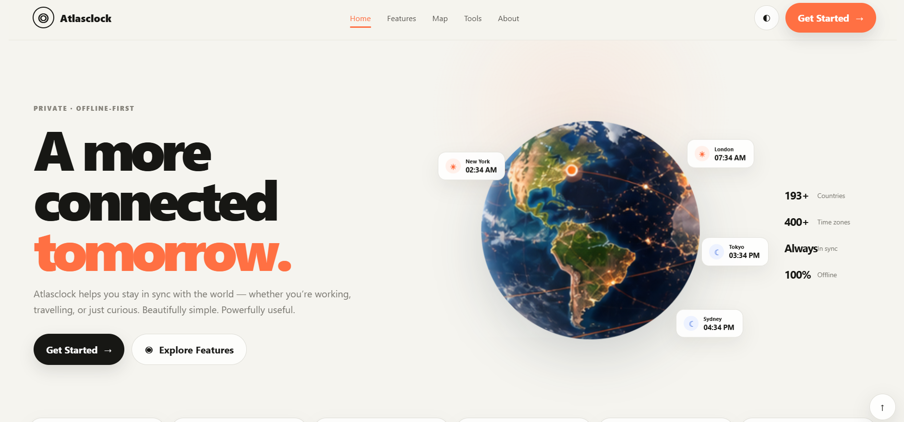
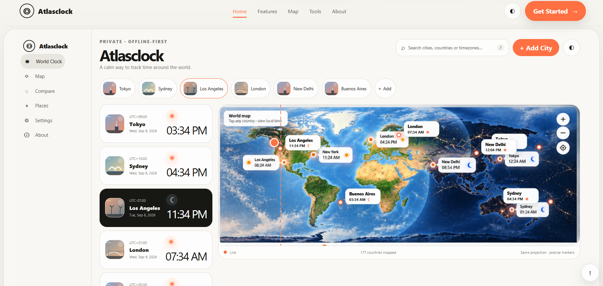
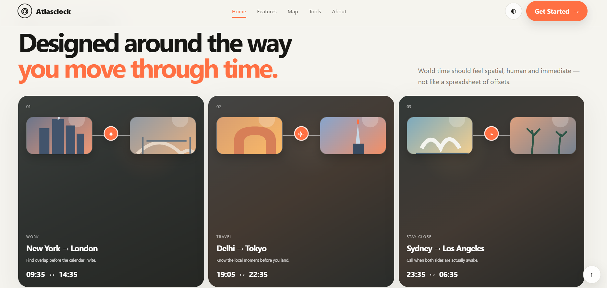
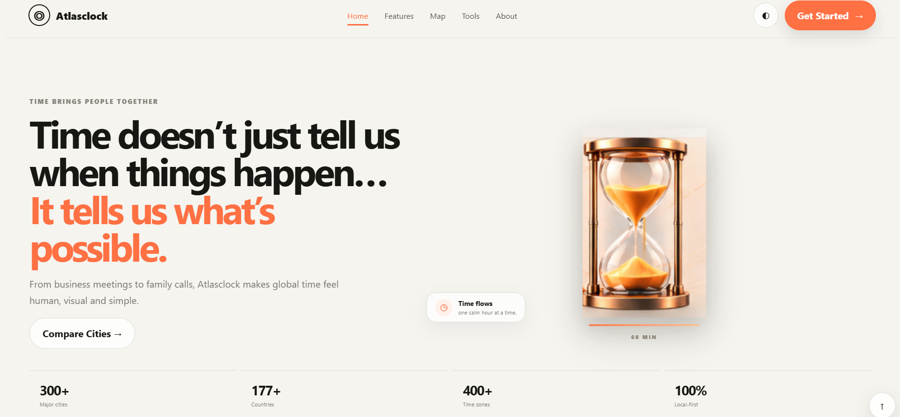

# 🌍 Atlasclock

### A visual world clock for a more connected world.

Atlasclock is a modern, interactive world-time dashboard that makes global time zones easier to understand.

Instead of showing only numbers and time zones, Atlasclock combines **live clocks, an interactive world map, city information, day/night context, time comparison, journey planning, and visual storytelling** into one experience.

---

## ✨ Features

- 🕐 **World Clock** — Track the local time of cities around the world.
- 🌎 **Interactive World Map** — Explore cities and time zones visually.
- 📍 **City Cards** — View local time, location and day/night status.
- 🔄 **Compare Time** — Understand the time difference between cities.
- ✈️ **Journey Planning** — Connect destinations and time zones.
- 🤝 **Stay Connected** — Make international communication easier.
- ⏳ **Animated Hourglass** — A visual representation of time passing.
- 📱 **Responsive Design** — Designed for desktop and smaller screens.
- ⚡ **Offline-First Assets** — Core application assets and data are stored locally.
- 🎨 **Premium Editorial UI** — A combination of typography, geography, motion and visual storytelling.

---

## 🖥️ Preview

### Home



### World Clock



### Interactive Map



### Journey



---

## 🎯 The Idea Behind Atlasclock

Most world-clock applications answer one simple question:

> **What time is it there?**

Atlasclock tries to answer something more meaningful:

> **What does that time mean for the people and places around me?**

A time such as `9:00 AM` means something different depending on where you are.

It could mean:

- 🌅 Someone is starting their morning.
- 💼 Someone is beginning their workday.
- 🍽️ Someone is having lunch.
- 🌙 Someone is getting ready for bed.

Atlasclock brings these perspectives together through **time + geography + visual context**.

---

## 🌐 What You Can Explore

### World Clock

See the current time across different global cities and understand the relationship between them.

### Interactive Map

Explore the world geographically while seeing where different cities sit across global time zones.

### Time Comparison

Compare locations and quickly understand the time difference between them.

### Journey

Think about travel through the relationship between destinations, local time and global schedules.

### Stay Connected

Designed for international teams, remote workers, travellers, students and families living across different time zones.

---

## 🎨 Design Philosophy

Atlasclock is designed to feel less like a traditional utility and more like a **visual travel experience**.

The interface uses:

- Warm off-white backgrounds
- Large editorial typography
- Orange and coral accents
- Geographic imagery
- Large visual elements
- Rounded dashboard cards
- Day/night indicators
- Subtle animations
- Spacious layouts
- Long-form visual storytelling

The goal is simple:

> **Make global time feel human.**

---

## 🧩 Project Structure

```text
Atlasclock/
│
├── data/
│   ├── cities.json
│   ├── map-verification.json
│   └── state.json
│
├── dist/
│   ├── assets/
│   ├── app.js
│   ├── cities.json
│   ├── countries.json
│   ├── index.html
│   ├── styles.css
│   └── world.svg
│
├── public/
│   ├── assets/
│   ├── app.js
│   ├── cities.json
│   ├── countries.json
│   ├── index.html
│   ├── styles.css
│   └── world.svg
│
├── scripts/
│   ├── build.js
│   └── build_map.py
│
├── screenshots/
│   ├── home.png
│   ├── world-clock.png
│   ├── map.png
│   └── journey.png
│
├── package.json
├── server.js
└── README.md
```

---

## 🛠️ Tech Stack

| Technology | Purpose |
|---|---|
| **HTML5** | Application structure |
| **CSS3** | Layout, styling and animations |
| **JavaScript** | Clocks, interactions and application logic |
| **SVG** | World map and geographic visuals |
| **JSON** | City and application data |
| **Node.js** | Local development server |
| **Python** | Map and build utilities |

---

## 🚀 Getting Started

### Clone the repository

```bash
git clone https://github.com/abhishek-mishra16/Atlasclock.git
```

### Open the project

```bash
cd Atlasclock
```

### Install dependencies

```bash
npm install
```

### Start the application

```bash
npm start
```

---

## 🔧 Development Commands

Build the project:

```bash
npm run build
```

Run development mode:

```bash
npm run dev
```

Check the project:

```bash
npm run check
```

---

## 📊 Atlasclock Experience

```text
                 🌍 ATLASCLOCK
                       │
          ┌────────────┼────────────┐
          ↓            ↓            ↓
      World Clock   World Map   City Explorer
          │            │            │
          └────────────┼────────────┘
                       ↓
                 Compare Time
                       │
                       ↓
                Journey Planning
                       │
                       ↓
                 Stay Connected
```

Atlasclock brings these experiences together into a single visual dashboard.

---

## 💡 Use Cases

Atlasclock can be useful for:

- 🌍 International teams
- 💻 Remote workers
- ✈️ Travellers
- 🎓 Students studying abroad
- 👨‍👩‍👧 Families living in different countries
- 📞 International calls and meetings
- 🗓️ Cross-time-zone scheduling
- 🧭 Exploring cities around the world

---

## 🔮 Future Possibilities

Potential improvements include:

- 🔔 Smart meeting-time recommendations
- 📅 Calendar integration
- 🌦️ Weather information
- ✈️ Flight and travel integration
- ⭐ Favourite cities
- 🔎 Advanced city search
- 🌐 Expanded global location database
- 📲 Progressive Web App improvements
- 🌓 Additional themes and personalization

---

## 📌 Project Status

**Atlasclock — World Clock Dashboard**

The project is being developed as a visual, interactive world-time experience focused on making global time easier to understand and explore.

---

## 👨‍💻 Author

**Abhishek Mishra**

GitHub:  
https://github.com/abhishek-mishra16

---

## 📄 License

This project currently does not include an open-source license.

If you plan to distribute or modify Atlasclock publicly, consider adding an appropriate license.

---

<p align="center">

### 🌍 Atlasclock

**See the world. Understand the time.**

🕐 · 🌎 · ✈️ · 🤝

</p>
